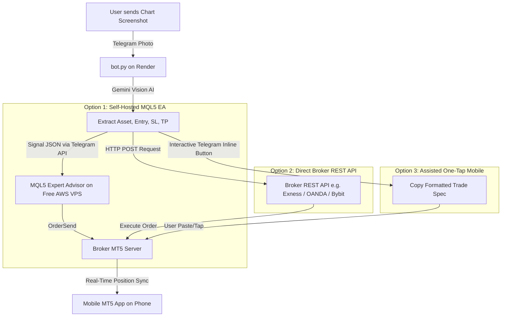

# Mobile MT5 Automated Trade Execution: Architecture & Roadmap

> **STATUS: SHELVED (2026-08-07).** Automated broker execution is no longer
> being worked on. `bot.py` no longer imports or calls `broker_api.py`, so no
> chart can place an order — the `BROKER_*` environment variables have no
> effect. `broker_api.py` and this document are kept for reference only.
> Focus has moved to the bot's chart interpretation and trade monitoring.
>
> Note if this is ever resumed: the execution path was never given a lot-size
> or risk model. It fell back to each provider's hardcoded default (0.01 lots
> for Exness, 1000 units for OANDA), which is not a position size anyone
> chose. That gap must be closed before it is wired back in.

This document outlines the architectural options and step-by-step roadmap for allowing the Telegram Bot (`bot.py`, hosted on Render) to automatically execute trades extracted from trading chart screenshots so that positions appear instantly on your **MetaTrader 5 (MT5) Mobile App (iOS / Android)**.

---

## 1. Executive Summary & Core Constraints

### The Mobile MT5 Reality
iOS and Android mobile apps run in strict sandboxes. Python scripts running in the cloud (e.g. Render) **cannot directly tap into the MT5 Mobile App** installed on your phone to press "Buy" or "Sell".

### How Mobile MT5 Automation Works
Even though the phone app itself cannot be scripted, your Mobile MT5 app connects to your **Broker's MT5 Trading Server**. 
- Whenever an order is placed **server-side** on your broker account, it **instantly reflects on your Mobile MT5 app**.
- You can monitor floating PnL, modify Stop Loss (SL) / Take Profit (TP), or close trades directly from your phone.

### User Security & Operational Rules
1. **No Personal Computer Dependency:** The solution must run 24/7 in the cloud without requiring a personal desktop or laptop to stay powered on.
2. **No Third-Party Credential Sharing:** Broker login numbers and passwords **must never** be shared with third-party cloud bridge services (such as MetaApi).

---

## 2. Architectural Options

---

### Option 1 (Recommended): Self-Hosted MQL5 Telegram Copier EA (Free VPS)
**Best for:** Traders using any standard MT5 broker who want 100% security and zero third-party data sharing.

#### How It Works
1. `bot.py` analyzes the chart screenshot on Render and broadcasts a structured signal message (or JSON) to a designated Telegram chat or channel.
2. A lightweight **MQL5 Expert Advisor (EA)** script running inside an official MT5 terminal on a free cloud VPS (such as **AWS EC2 Micro Free Tier**, $0/month) polls the Telegram API (`WebRequest`).
3. Upon receiving the signal from `bot.py`, the EA executes the trade via MT5's native `OrderSend()` function.
4. The trade immediately pops up on your **Mobile MT5 app**.

#### Security & Privacy Profile
- **Zero Third-Party Access:** Your MT5 account login and password remain encrypted inside the official MetaTrader 5 terminal on your own private server instance.
- **No API Keys Needed:** Operates via standard MT5 terminal connectivity.

#### Implementation Steps
- [ ] Create `MQL5/TelegramSignalCopier.mq5` script in this repository.
- [ ] Configure `WebRequest` URLs in MT5 (`https://api.telegram.org`).
- [ ] Implement lot-size calculation based on account balance and risk % or fixed lots.
- [ ] Document free-tier AWS EC2 / Linux VPS setup for 24/7 MT5 terminal hosting.

---

### Option 2: Direct Broker REST API (Zero VPS / Terminal Needed)
**Best for:** Traders whose broker provides an official HTTP REST API (e.g. Exness, OANDA, Bybit, IC Markets cTrader).

#### How It Works
1. You generate an official API Key from your broker client dashboard with **Trade permissions only** (withdrawal permissions explicitly disabled).
2. `bot.py` on Render sends an HTTP POST request directly to your broker's official API endpoint when a chart is analyzed.
3. The broker server opens the position, and it syncs instantly to your **Mobile App**.

#### Security & Privacy Profile
- **Zero VPS / Desktop Terminal Required:** No MT5 terminal needs to be hosted anywhere.
- **Restricted Token Scope:** API tokens cannot withdraw funds.

#### Implementation Steps
- [x] Identify broker API documentation and authentication mechanism (Exness Webhook/REST API + symbol suffix formatting).
- [x] Create `broker_api.py` helper in this repository to wrap order execution calls (`execute_exness_order`).
- [x] Add environment variables (`BROKER_PROVIDER=exness`, `BROKER_WEBHOOK_URL`, `EXNESS_SYMBOL_SUFFIX`) to `.env.example`.
- [x] Integrate automatic execution into `bot.py`'s `handle_chart` pipeline.

---

### Option 3: Assisted Mobile "One-Tap" Inline Telegram Buttons
**Best for:** Zero server setup, zero broker account connectivity, semi-automated workflow.

#### How It Works
1. When `bot.py` replies with the analyzed signal card, it attaches interactive Telegram **Inline Keyboard Buttons** (e.g., `[ 📋 Copy Trade Spec ]` / `[ 📱 Open MT5 ]`).
2. Tapping the button on your mobile device formats the exact symbol, lot size, SL, and TP into your phone clipboard for immediate pasting into Mobile MT5.

#### Security & Privacy Profile
- **100% Offline from Account:** The bot never connects to or knows your trading account.

#### Implementation Steps
- [ ] Build Telegram inline keyboards in `bot.py`.
- [ ] Add callback query handlers for mobile formatting shortcuts.

---

## 3. Decision & Implementation Tracker

| Option | Status | Selected | Next Action |
| --- | --- | --- | --- |
| **Option 1: Self-Hosted MQL5 EA** | Archived | ❌ No | — |
| **Option 2: Direct Broker REST API** | In Progress | ✅ **SELECTED** | Identify user's broker & build `broker_api.py` execution module. |
| **Option 3: Assisted Mobile Buttons** | Archived | ❌ No | — |

---

## 4. Documentation Log

- **2026-07-31 (15:06 WAT):** User explicitly selected **Option 2 (Direct Broker REST API)** for automated Mobile MT5 trade execution. This eliminates the need for any local desktop computer or cloud VPS while maintaining 100% security via trade-only REST API keys.
- **2026-07-31:** Created initial architecture document comparing Mobile MT5 execution strategies without third-party credential bridges or local PC dependency.
